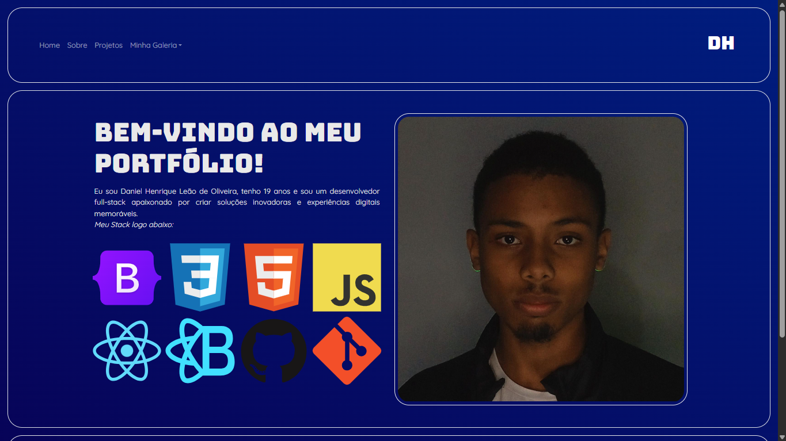

# 💼 Portfólio Pessoal

Projeto desenvolvido para apresentar minhas habilidades, tecnologias e projetos como Desenvolvedor Full Stack com foco em Front-End.

---

## 📖 Sobre o Projeto

Este portfólio foi criado utilizando React e Bootstrap com o objetivo de centralizar informações profissionais, experiências e projetos em uma interface moderna e responsiva.

O projeto foi desenvolvido para praticar:

- Componentização com React
- Navegação SPA com React Router
- Organização de código em componentes reutilizáveis
- Responsividade com Bootstrap
- Estruturação de projetos Front-End

---

## 🚀 Tecnologias Utilizadas

<div align="center">


</div>

---

## 📂 Estrutura do Projeto

```text
src/
│
├── assets/
│   ├── css/
│   └── img/
│
├── components/
│   ├── Navbar.tsx
│   ├── Footer.tsx
│   ├── ContentHome.tsx
│   ├── ContentSobre.tsx
│   └── ContentProjetos.tsx
│
├── pages/
│   ├── Home.tsx
│   ├── Sobre.tsx
│   └── Projetos.tsx
│
├── rotas/
│   └── Rotas.tsx
│
├── App.tsx
└── main.tsx
```

---

## ✨ Funcionalidades

- Navegação entre páginas sem recarregamento
- Página inicial com apresentação profissional
- Exibição das tecnologias utilizadas
- Layout responsivo
- Estrutura preparada para novos projetos

---

## ⚙️ Instalação

Clone o repositório:

```bash
git clone https://github.com/seuusuario/seurepositorio.git
```

Entre na pasta:

```bash
cd seurepositorio
```

Instale as dependências:

```bash
npm install
```

Execute o projeto:

```bash
npm run dev
```

---

## 📸 Demonstração

### Página Inicial



### Página de Projetos


### Página Sobre


---

## 🔮 Melhorias Futuras

- [ ] Implementar tema Dark/Light
- [ ] Adicionar animações com Framer Motion
- [ ] Integração com GitHub API
- [ ] Formulário de contato funcional
- [ ] Deploy em Vercel
- [ ] Migração completa para TypeScript

---

## 👨‍💻 Autor

**Daniel Henrique Leão de Oliveira**

- GitHub: https://github.com/DanielLeaoOliveira
- LinkedIn: adicionar link
- Email: contato profissional

---